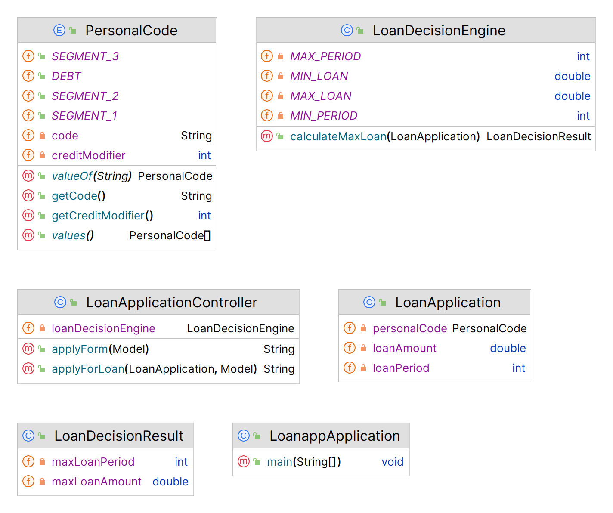
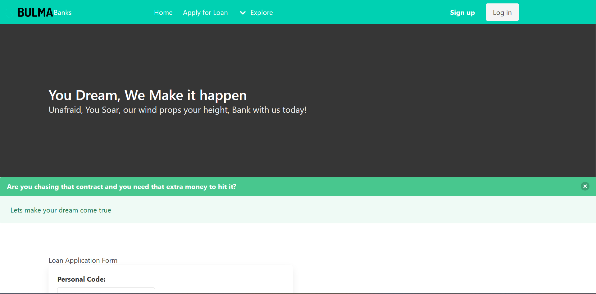
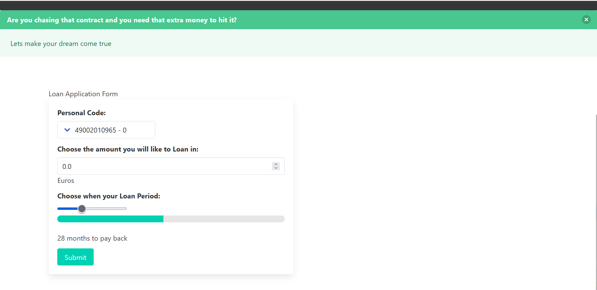
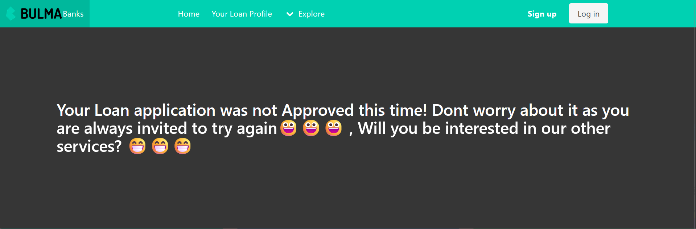
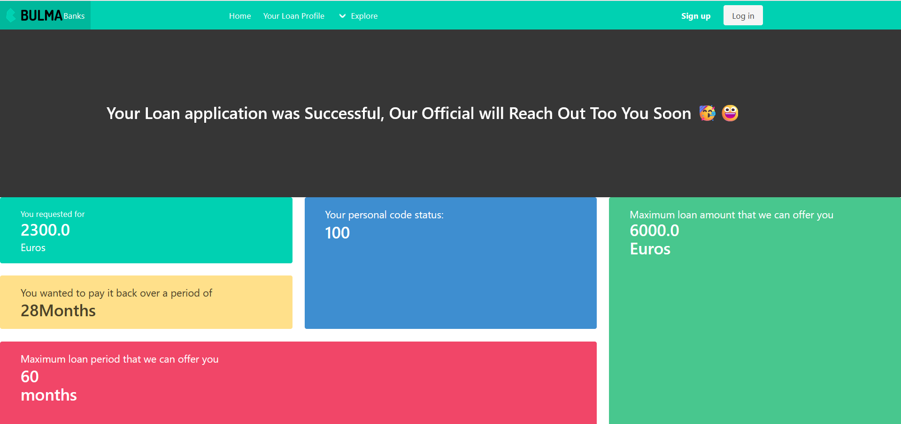
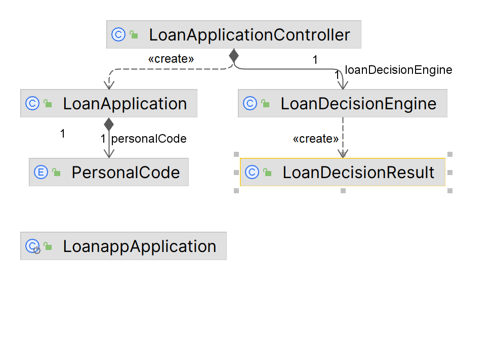
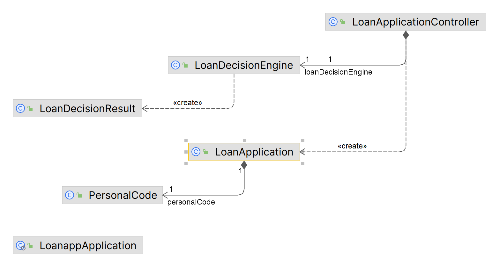

# loanapp

## interesting app that  simulates 4 scenerios based on an the credit system of an individual when using the app

### its uses thymeleaf as the frontend with bulma as css

## it also uses h2 as well as springboot jpa,validation hibernates,

## could be updated with login functions with auth0, search saved loan application by creating a new profile and checking how many applications was accepted, rejected,
## I hope you love it as I had fun building it,

## the Pom file contains the dependencies and the version of java used, 

## in the future, will upgrade it to java 17 or 21

# it uses this info to build its docker file

https://github.com/dbillion/loanapp/assets/49393855/e473c2cc-f032-4feb-947e-1c2e8a55cecf

FROM eclipse-temurin:11.0.14.1_1-jdk-alpine
VOLUME /tmp
ARG JAR_FILE=target/*.jar
COPY ${JAR_FILE} app.jar
ENTRYPOINT java ${JAVA_OPTS} -jar /app.jar

# it also build its docker file like this
on the command line
docker build -t dbillion/loanapp .
docker run -p 9000:9000 -e JAVA_OPTS="-Dserver.port=9000" dbillion/loanapp

docker login
docker tag local-image:loanapp new-repo:loanapp
docker push new-repo:loanapp

deployed on render as 
### weblink https://loanapp-2aev.onrender.com/

## we started with the personal code and chose the 4 scenerios given

: 

public enum PersonalCode { DEBT("49002010965"), # scenerios 1
    SEGMENT_1("49002010976", 100), # scenerios 2
    SEGMENT_2("49002010987", 300),  # scenerios 3
    SEGMENT_3("49002010998", 1000); # scenerios 4
    
    private final String code; based on our goal of modifying it
    private final int creditModifier;

    PersonalCode(String code, int creditModifier) {
        this.code = code;
        this.creditModifier = creditModifier;
    }

    PersonalCode(String code) {
        this(code, 0);
    }

    public String getCode() {
        return code;
    }

    public int getCreditModifier() {
        return creditModifier;
    }
}

the result we expect irrespective of the loan answer, positive or negative

@Data
public class LoanDecisionResult {
    private double maxLoanAmount;
    private int maxLoanPeriod;
}

## here we perform most of the logic
@Service
public class LoanDecisionEngine {
    private static final double MIN_LOAN = 2000;
    private static final double MAX_LOAN = 10000;
    private static final int MIN_PERIOD = 12;
    private static final int MAX_PERIOD = 60;
    the constraint given

    public LoanDecisionResult calculateMaxLoan(LoanApplication loanApplication) {
        LoanDecisionResult result = new LoanDecisionResult();  we create an object from loandecision result 

        if (loanApplication.getPersonalCode() == PersonalCode.DEBT) {
            return result; we return our result if the loanapplication  engine equals personal code debt, 
        }

        int creditModifier = loanApplication.getPersonalCode().getCreditModifier(); , 
        double maxLoanAmount = 0; #created a zero max loan ammount
        int maxLoanPeriod = 0; #created a zero max loan period

        for (double loanAmount = MIN_LOAN; loanAmount <= MAX_LOAN; loanAmount++) {
            for (int loanPeriod = MIN_PERIOD; loanPeriod <= MAX_PERIOD; loanPeriod++) {
                double creditScore = (creditModifier / loanAmount) * loanPeriod;
                if (creditScore >= 1 && loanAmount > maxLoanAmount) {
                    maxLoanAmount = loanAmount;
                    maxLoanPeriod = loanPeriod;
                }
            }
        }

        result.setMaxLoanAmount(maxLoanAmount);
        result.setMaxLoanPeriod(maxLoanPeriod);
        return result;
    }
}

## ## here we determine the path through the controller

:@Controller
public class LoanApplicationController {
    private final LoanDecisionEngine loanDecisionEngine;

    public LoanApplicationController(LoanDecisionEngine loanDecisionEngine) {
        this.loanDecisionEngine = loanDecisionEngine;
    }

    @GetMapping("/")
    public String applyForm(Model model) {
        model.addAttribute("loanApplication", new LoanApplication());
        model.addAttribute("personalCodes", PersonalCode.values());
        return "apply"; 
    }

    @PostMapping("/results")
    public String applyForLoan(@ModelAttribute LoanApplication loanApplication, Model model) {
        LoanDecisionResult result = loanDecisionEngine.calculateMaxLoan(loanApplication);

        model.addAttribute("requestedLoanAmount", loanApplication.getLoanAmount());
        model.addAttribute("requestedLoanPeriod", loanApplication.getLoanPeriod());
        model.addAttribute("personalCode", loanApplication.getPersonalCode());
        model.addAttribute("creditModifier", loanApplication.getPersonalCode().getCreditModifier());

        if (result.getMaxLoanAmount() == 0) {
            model.addAttribute("message",
                    "Your Loan application was not Approved this time! Dont worry about it as you are always invited to try again😀😀😀 ,  Will you be interested in our other services? 😁😁😁");
        } else {
            model.addAttribute("message","Your Loan application was Successful, Our Official will Reach Out Too You Soon 🥳😀 "
                          );
        }

        model.addAttribute("result", result);
        return "results"; 
    }
}

and we run the app with this class

@SpringBootApplication
public class LoanappApplication {

	public static void main(String[] args) {
		SpringApplication.run(LoanappApplication.class, args);
	}

}

OUR LANDING PAGE

THE FORM

THE RESULTS

OTHER RESULTS

THE UML

OR

